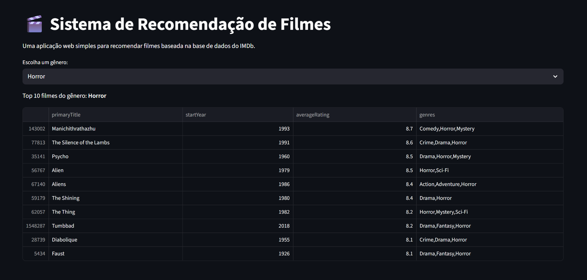

## 🎬 Sistema de Recomendação de Filmes

### [➡️ Ver a Aplicação Online](https://sistema-recomendacao-filmes-9tjpjcw8kwxer8xgzgrhq5.streamlit.app/)

Este projeto é uma **aplicação web interativa** construída com **Python** e **Streamlit** que recomenda filmes com base numa amostra da vasta base de dados do **IMDb**. O objetivo é demonstrar o ciclo completo de uma aplicação de dados, desde a recolha e limpeza de dados até à criação de uma interface de utilizador funcional.



---

## ✨ Funcionalidades

- 🖥️ **Interface Web Interativa:** Construída com **Streamlit** para uma experiência de utilizador limpa e moderna.
- 👇 **Seleção de Género:** Um menu _dropdown_ permite ao utilizador escolher facilmente entre dezenas de géneros.
- 🗃️ **Processamento de Dados:** Utiliza a biblioteca **Pandas** para carregar, limpar e processar os ficheiros de dados.
- ⚡ **Cache Inteligente:** O Streamlit armazena os dados processados para garantir que a aplicação seja rápida e responsiva.
- ☁️ **Hospedagem:** A aplicação está hospedada via **Streamlit Community Cloud** para acesso público.

---

## 🛠️ Tecnologias Utilizadas

- **Linguagem:** Python 3
- **Bibliotecas:** pandas, streamlit
- **Hospedagem:** Streamlit Community Cloud
- **Controlo de Versão:** Git & GitHub

---

## 🚀 Como Executar o Projeto Localmente

```bash
# 1. Clone o repositório
git clone [https://github.com/JVictorVeloso/sistema-recomendacao-filmes.git](https://github.com/JVictorVeloso/sistema-recomendacao-filmes.git)

# 2. Navegue até à pasta do projeto
cd sistema-recomendacao-filmes

# 3. Crie e ative um ambiente virtual
python -m venv venv
.\venv\Scripts\activate

# 4. Instale as dependências
pip install -r requirements.txt

# 5. Rode a aplicação
streamlit run app.py
```
